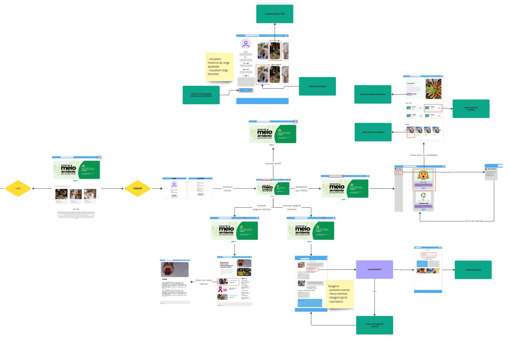
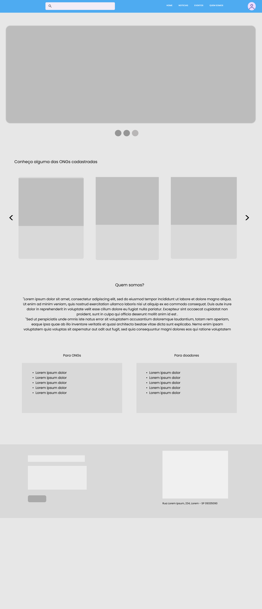
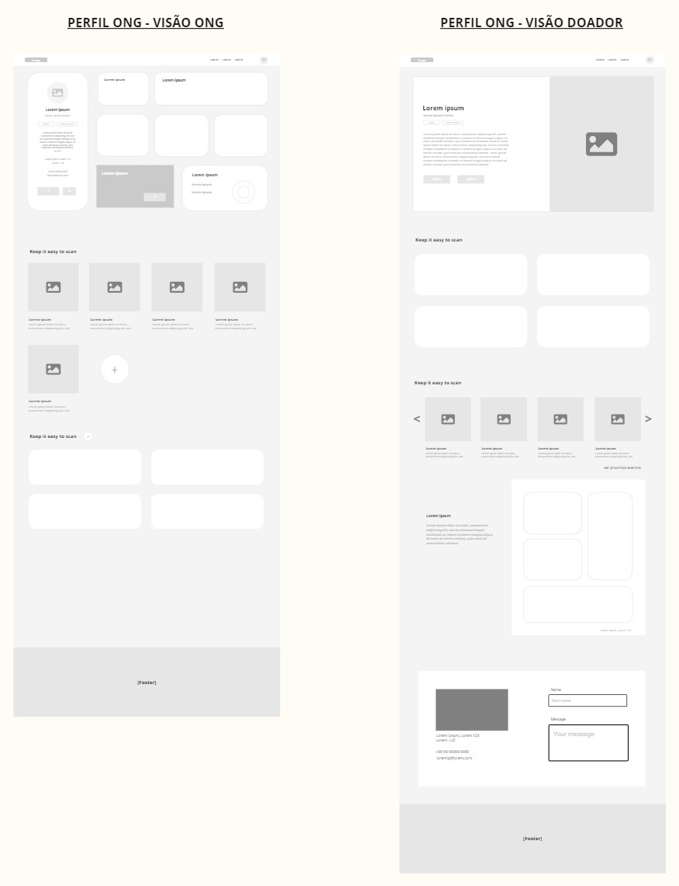
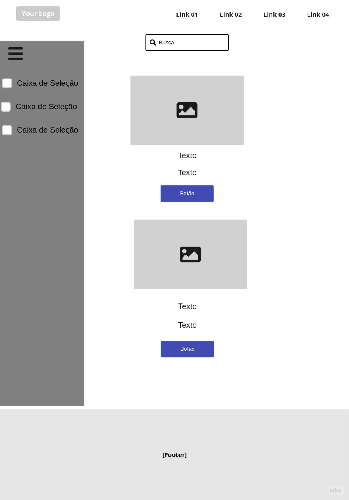
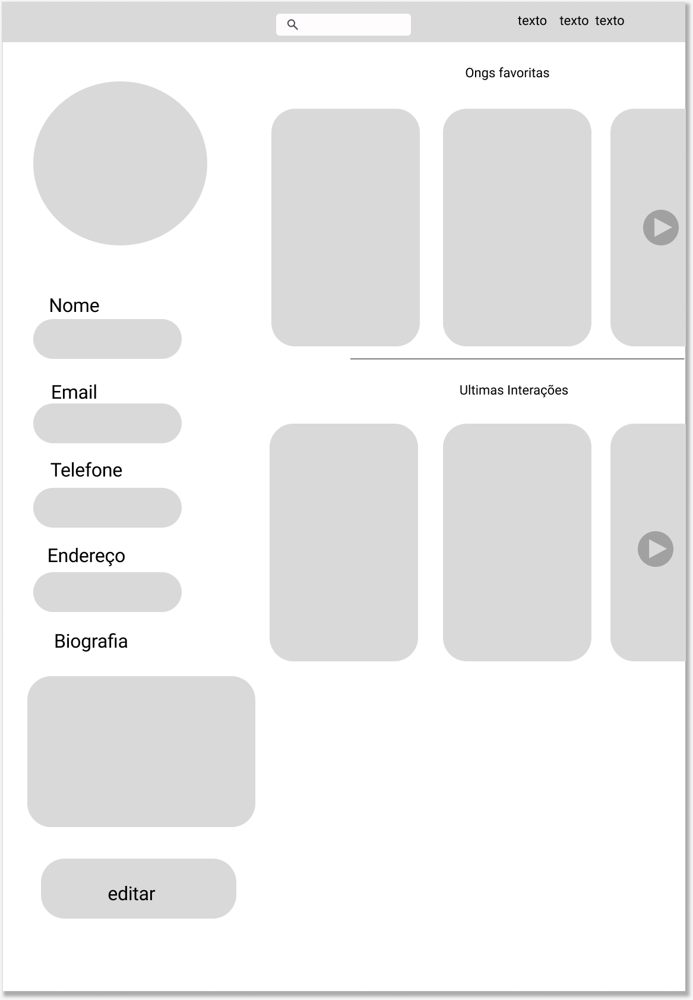
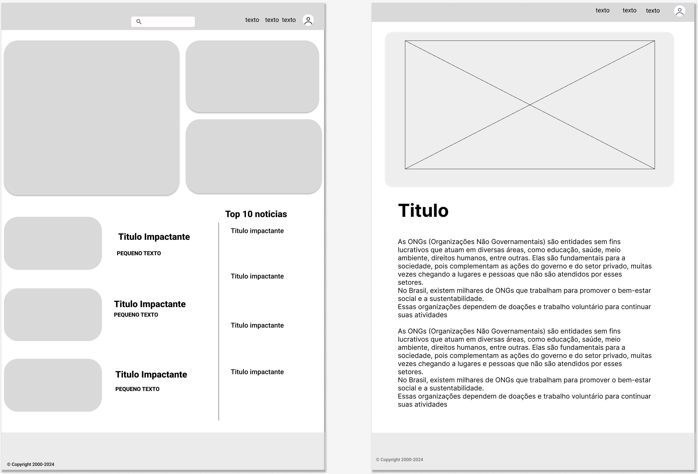
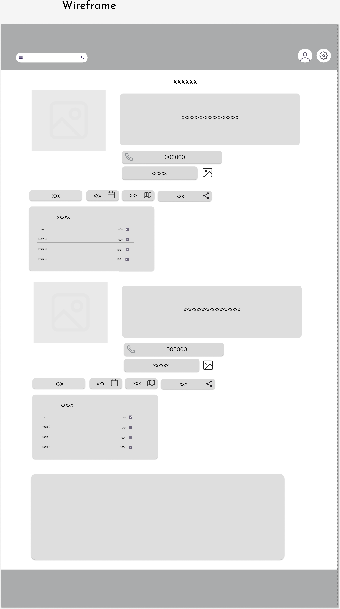

# Projeto de Interface

Visão geral da interação do usuário pelas telas do sistema e protótipo interativo das telas com as funcionalidades que fazem parte do sistema (wireframes).

Apresente as principais interfaces da plataforma. Discuta como ela foi elaborada de forma a atender os requisitos funcionais, não funcionais e histórias de usuário abordados nas <a href="2-Especificação do Projeto.md"> Documentação de Especificação</a>.

## User Flow

A interface da plataforma foi desenvolvida com o objetivo de conectar os usuários de forma engajadora, dinamica e intuitiva. O User Flow foi cuidadosamente elaborado para priorizar a experiencia do usuário, garantindo que cada etapa do processo seja intuitiva e satisfatória.

### Páginas principais

O user flow conta com cinco páginas, sendo tres delas compartilhadas entre ambos os usuários:

1. Home

   Na página inicial estão dsponibilizados banners informativos com eventos e notícias de interesse dos usuários. Além disso, também estão disponíveis informações a respeito da plataforma, como la funciona, nossa missão, visão e valores, algumas das ONGs cadastradas e informações de contato.

2. Tela de Login e Cadastro

   A tela de login permite que o usuário se identifique e possa acessar a plataforma com seu perfil de nível "Doador".
   A tela de cadastro permite que o usuário escolha o nível de seu perfil entre "Doador" e "ONG" para depois, personalizar suas preferencias em causas que possue interesse, cidade, idade e demais dados.

3. Notícias

   A página disponibilizará as principais noticias relacionadas aos temas abordados pelas organizações, além das principais discussões acerca destes assuntos nas mídias. Ela será alimentada pela equipe criadora da plataforma com o intuito de manter nossos usuários informadoos, além de incentiva-los a se manter engajados nas causas.

### User Flow: Usuário Doador

Link do User Flow: https://miro.com/app/board/uXjVLXatsi4=/

1. Eventos

   A página de eventos para o usuário doador, irá conter as ações cadastrados pelas Instituições da plataforma, permitindo que os usuários doadores se inscrevam nestes eventos.

2. Perfil do Usuário

   O perfil do usuário doador irá possibilitar que ele:

   - Visualize e edite suas informações pessoais;
   - Visualize e edite as informações preferenciais;
   - Visualize e exclua ONGs favoritas;
   - Visualize o histórico de ONGs recentemente visualizadas.

### User Flow: Usuário ONG

Link do User Flow: https://miro.com/app/board/uXjVLXatsi4=/

1. Eventos

   A página de eventos para o usuário ONG, irá conter os eventos cadastrados listados, disponibilizando as opções para criar um novo evento e editar eventos já criados por elas.

2. Perfil do Usuário

   O perfil do usuário ONG irá possibilitar que ele:

   - Visualize as principais métricas do mes;
   - Exporte as métricas em formato PDF;
   - Visualize e edite as informações principais da ONG;
   - Visualize registros já criados, exclua e crie novos;
   - Visualize projetos já criados, exclua e crie novos;

## Wireframes

São protótipos usados em design de interface para sugerir a estrutura de um site web e seu relacionamentos entre suas páginas. Um wireframe web é uma ilustração semelhante do layout de elementos fundamentais na interface e é fundamental sempre relacionar cada wireframe com o(s) requisito(s) que ele atende.

### Página Home

A página inicial apresenta uma navigation bar no topo, permitindo o acesso as demais páginas da aplicação.

- Primeira seção: Possui um carrossel com banners informativos que encaminham para a página de "noticias";
- Segunda seção: Possui um carrossel desmonstrativo com ONGs cadastradas na plataforma;
- Terceira seção: Possuí um paragrafo e dois cards explicativos sobre a plataforma;
- Quarta seção: Contém as informações de contato e uma área destinada ao mapa com o endereço de contato.

### Modal Login / Cadastro

O modal de Login/Cadasto é aberto já na tela de Log In com os campos para colocar usuário e senha, e um botão com a opção de recuperar o acesso via "Esqueceu a senha". Possui a opção para mudar para a tela de cadastro onde serão mostrados os campos requeridos para se cadastrar na plataforma e qual é o nível do usuário, tendo as opções "Sou Doador" e "Sou ONG".

### Perfil do usuário - ONG

A página do perfil do usuário ONG apresenta uma navigation bar no topo, permitindo o acesso as demais páginas da aplicação.

- Primeira seção: Possui uma seção na lateral esquerda com as principais informações da instituição e um botão para editar. No restante da seção, a direita, é apresentado o dashboard de métricas mensais da organização, onde também é disponibilizado a opção de gerar um arquivo PDF com a informações;
- Segunda seção: Disponibiliza a opção para a criação de cards com imagens, titulo e descrição. Ao clicar no card, sera mostrado um modal com mais informações e a opção de "editar e "excluir";
- Terceira seção: Disponibiliza a opção para a criação de cards com os projetos das intituições com imagem, titulo e descrição. Ao clicar no card, sera mostrado um modal com mais informações e a opção de "editar e "excluir";

### Página Listagem

A página de listagem apresenta uma navigation bar no topo, permitindo o acesso as demais páginas da aplicação.

- Primeira seção: Possui uma barra lateral à esquerda com caixas de seleção, que funcionam como opções rápidas para filtrar a busca.
- Segunda seção: Exibe os resultados da busca com informações principais sobre as ONGs, como imagem, nome e descrição, além de um botão para acessar o perfil de cada ONG.

### Perfil do doador - ONG

A página “Perfil do Doador” apresentará ao usuário suas últimas interações, ONGs favoritas e a possibilidade de editar as informações do seu perfil.

### Noticias

A página de notícias, como o nome sugere, apresentará notícias sobre ONGs, pesquisas e um pouco dos seus trabalhos.

- Na página inicial de notícias, as notícias com imagens estarão posicionadas no lado direito, enquanto as principais notícias, apenas com texto, estarão no lado esquerdo. Ao clicar em uma notícia, o usuário será redirecionado para a página de leitura.

### Página de eventos

A página de listagem exibe uma barra de navegação no topo, permitindo o acesso às demais áreas da aplicação.

- ONG: É possível visualizar e editar eventos já criados, além de criar novos eventos.
- Doador: O usuário pode visualizar os próximos eventos, ver eventos favoritos, acessar uma listagem geral de eventos e um calendário com datas de eventos passados e futuros. Também é possível se voluntariar para participar dos eventos.

