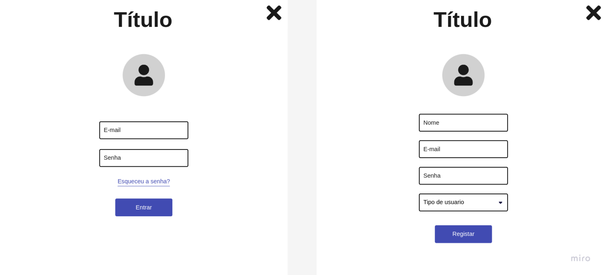

# Projeto de Interface

Visão geral da interação do usuário pelas telas do sistema e protótipo interativo das telas com as funcionalidades que fazem parte do sistema (wireframes).

 Apresente as principais interfaces da plataforma. Discuta como ela foi elaborada de forma a atender os requisitos funcionais, não funcionais e histórias de usuário abordados nas <a href="2-Especificação do Projeto.md"> Documentação de Especificação</a>.

## User Flow

A interface da plataforma foi desenvolvida com o objetivo de conectar os usuários de forma engajadora, dinamica e intuitiva. O User Flow foi cuidadosamente elaborado para priorizar a experiencia do usuário, garantindo que cada etapa do processo seja intuitiva e satisfatória.

### Páginas principais
O user flow conta com cinco páginas, sendo tres delas compartilhadas entre ambos os usuários:

1. Home
  
   Na página inicial estão dsponibilizados banners informativos com eventos e notícias de interesse dos usuários. Além disso, também estão disponíveis informações a respeito da plataforma, como la funciona, nossa missão, visão e valores, algumas das ONGs cadastradas e informações de contato. 

2. Tela de Login e Cadastro
   
   A tela de login permite que o usuário se identifique e possa acessar a plataforma com seu perfil de nível "Doador".
   A tela de cadastro permite que o usuário escolha o nível de seu perfil entre "Doador" e "ONG" para depois, personalizar suas preferencias em causas que possue interesse, cidade, idade e demais dados.

3. Notícias
   
   A página disponibilizará as principais noticias relacionadas aos temas abordados pelas organizações, além das principais discussões acerca destes assuntos nas mídias. Ela será alimentada pela equipe criadora da plataforma com o intuito de manter nossos usuários informadoos, além de incentiva-los a se manter engajados nas causas.

### User Flow: Usuário Doador

1. Eventos
   
   A página de eventos para o usuário doador, irá conter as ações cadastrados pelas Instituições da plataforma, permitindo que os usuários doadores se inscrevam nestes eventos. 

2. Perfil do Usuário
   
    O perfil do usuário doador irá possibilitar que ele:
    - Visualize e edite suas informações pessoais;
    - Visualize e edite as informações preferenciais;
    - Visualize e exclua ONGs favoritas;
    - Visualize o histórico de ONGs recentemente visualizadas.

### User Flow: Usuário ONG

1. Eventos

   A página de eventos para o usuário ONG, irá conter os eventos cadastrados listados, disponibilizando as opções para criar um novo evento e editar eventos já criados por elas.
   
3. Perfil do Usuário

   O perfil do usuário ONG irá possibilitar que ele:
   - Visualize as principais métricas do mes;
   - Exporte as métricas em formato PDF;
   - Visualize e edite as informações principais da ONG;
   - Visualize registros já criados, exclua e crie novos;
   - Visualize projetos já criados, exclua e crie novos;

## Wireframes

São protótipos usados em design de interface para sugerir a estrutura de um site web e seu relacionamentos entre suas páginas. Um wireframe web é uma ilustração semelhante do layout de elementos fundamentais na interface e é fundamental sempre relacionar cada wireframe com o(s) requisito(s) que ele atende.

### Página Home

A página inicial apresenta uma navigation bar no topo, permitindo o acesso as demais páginas da aplicação. A primeira seção da página possui um carrossel com banners informativos, enquanto na segunda seção há outro carrossel desmonstrativo com ONGs cadastradas na plataforma. Já a terceira seção possuí um paragrafo e dois cards explicativos sobre a plataforma, enquanto na quarta seção estão as informações de contato e uma área destinada ao mapa com o endereço de contato.

### Modal Login / Cadastro

O modal de Login/Cadasto é aberto já na tela de Log In com os campos para colocar usuário e senha, e um botão com a opção de recuperar o acesso via "Esqueceu a senha". Possui a opção para mudar para a tela de cadastro onde serão mostrados os campos requeridos para se cadastrar na plataforma e qual é o nível do usuário, tendo as opções "Sou Doador" e "Sou ONG".

### Exemplo

A tela inicial apresenta um menu lateral com as principais seções do portal, enquanto a navigation bar, ao topo, apresenta informações de envio de imagens ou navegação pela galeria de fotos. A área central apresenta a galeria de fotos na forma de uma grade. Nesta tela, são apresentados os seguintes requisitos

 
> **Links Úteis**:
> - [Protótipos vs Wireframes](https://www.nngroup.com/videos/prototypes-vs-wireframes-ux-projects/)
> - [Ferramentas de Wireframes](https://rockcontent.com/blog/wireframes/)
> - [MarvelApp](https://marvelapp.com/developers/documentation/tutorials/)
> - [Figma](https://www.figma.com/)
> - [Adobe XD](https://www.adobe.com/br/products/xd.html#scroll)
> - [Axure](https://www.axure.com/edu) (Licença Educacional)
> - [InvisionApp](https://www.invisionapp.com/) (Licença Educacional)
