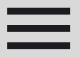

# Template padrão do site

Layout padrão do site (HTML e CSS) que será utilizado em todas as páginas com a definição de identidade visual, aspectos de responsividade e iconografia.

Explique as guias de estilo utilizadas no seu projeto.

## Design

Detalhe os layouts que serão utilizados. Apresente onde será colocado o logo do sistema. Defina os menus padrões, entre outras coisas.

## Cores

criado em : https://color.adobe.com/pt/create/

## Tipografia

### Poppins
Função: Títulos de página e Títulos de Seção
Link: https://fonts.google.com/specimen/Poppins

### Roboto
Função: Parágrafos e Descrições
Link: https://fonts.google.com/specimen/Roboto

## Iconografia

### Icone perfil

O ícone permanecerá no lugar da foto do usuário até que ele decida trocá-lo.

### Icone menu

O ícone de menu ficará no canto esquerdo da página de interface. Seu objetivo é ocultar ou mostrar os filtros ao ser clicado.

