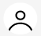
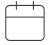

# Template padrão do site

Layout padrão do site (HTML e CSS) que será utilizado em todas as páginas com a definição de identidade visual, aspectos de responsividade e iconografia.

Explique as guias de estilo utilizadas no seu projeto.

## Design

Detalhe os layouts que serão utilizados. Apresente onde será colocado o logo do sistema. Defina os menus padrões, entre outras coisas.

## Cores

criado em : https://color.adobe.com/pt/create/

## Tipografia

### Poppins

Função: Títulos de página e Títulos de Seção
Link: https://fonts.google.com/specimen/Poppins

### Roboto

Função: Parágrafos e Descrições
Link: https://fonts.google.com/specimen/Roboto

## Iconografia

### Icone Perfil

O ícone permanecerá no lugar da foto do usuário até que ele decida trocá-lo.

### Icone Menu

O ícone de menu ficará no canto esquerdo da página de interface. Seu objetivo é ocultar ou mostrar os filtros ao ser clicado.

### Icone Calendario

Ícone de calendário que ficara na pagina de eventos. Ao clicar, direciona para o contêiner de calendário abaixo.

### Icone Compartilhamento

Ícone para compartilhar. Ao clicar, abrirá um pop-up para escolher a rede social.

### Icone Telefone

Ícone ilustrativo que ficará ao lado do número de telefone.

### Icones Redes Sociais

Ícones para compartilhar diretamente na rede específica.

